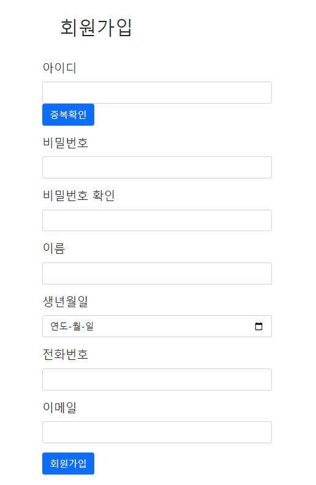
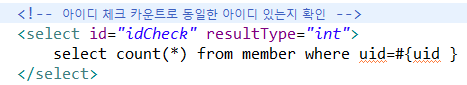
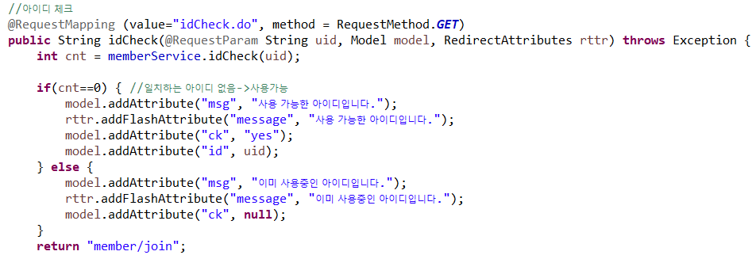

# Project 3
## Gentle Monster 웹 앱 어플리케이션
안경, 선글라스 쇼핑몰

- 개발 환경 : Spring 5.0.7, JAVA 1.8, Apache Tomcat 9.0, My SQL 8.0
- 주요 기술 : Java/JSP, Spring, mybatis, jUnit4, JavaScript, HTML/CSS, MVC2 Pttern, Jquery, Ajax, lombok
- 수행 기간 : 2022.07.05 ~ 2022.07.29
- 구현 내용
    1. 회원기능
        * 회원가입
        

        입력 된 아이디를 select하고 리턴 타입을 int로 받고
        
        return 값이 0 일경우 같은 아이디가 없으므로 가입이 가능하게 model을 통해 아이디값을 전달, return값이 0 이상일 경우 같은 아이디가 있으므로 아이디값을 null로 전달
        

