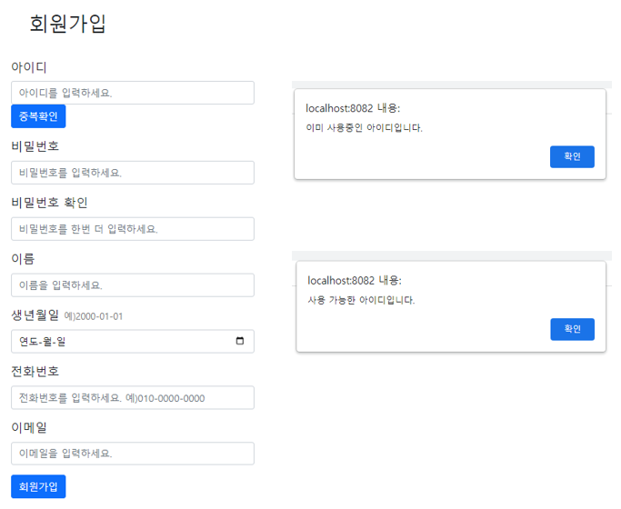
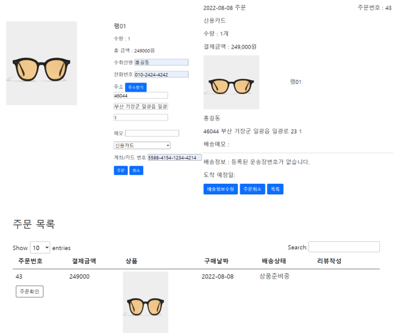
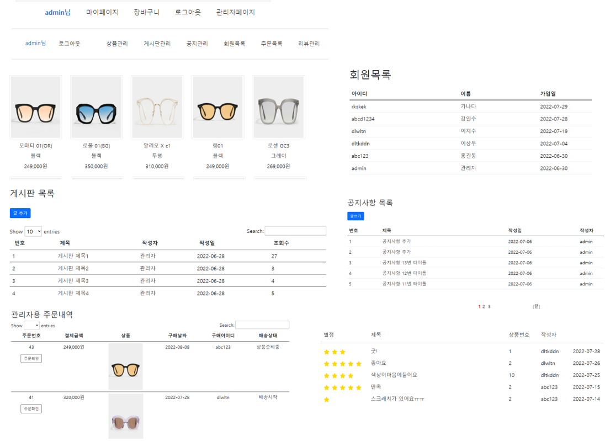
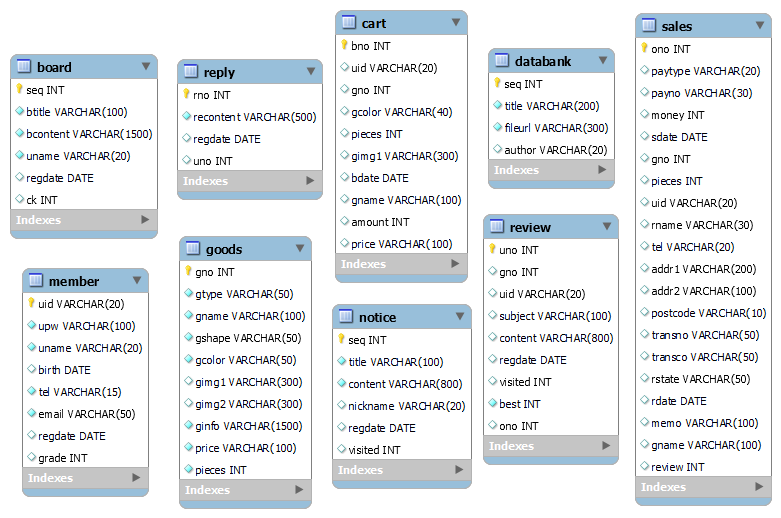

# Project 3
## Gentle Monster 웹 앱 어플리케이션
안경, 선글라스 쇼핑몰

- 개발 환경 : Spring 5.0.7, JAVA 1.8, Apache Tomcat 9.0, My SQL 8.0
- 주요 기술 : Java/JSP, Spring, mybatis, jUnit4, JavaScript, HTML/CSS, MVC2 Pttern, Jquery, Ajax, lombok
- 수행 기간 : 2022.07.05 ~ 2022.07.29
- 구현 내용    

    1. 메인화면

        
        * mapper에서 상품 중 최근 등록 된 순서대로 5개를 조회하여 신상품 목록을 구성
        * goods테이블과 sales 테이블을 조인하여 판매가 가장 많이 된 5개를 팬매순으로 Best 목록 구성  

    #      
    2. 회원기능  

          

        * 중복확인 버튼을 누르면 데이터베이스에서 같은 아이디기 있는지 select 하여 리턴값이 있을 경우에는 controller에서 ck의 값을 null처리하고, '사용중인 아이디' 메세지를 전달, 리턴되는 값이 없을 경우에는 ck의 값을 yes로 전달하고 '사용 가능한 아이디' 메세지를 전달하여 ck값이 있을 때만 회원가입 처리
        * 자바스크립트로 비밀번호와 비밀번호 확인 값이 동일하면 회원가입처리
        * controller에서 BCryptPasswordEncoder를 Inject하여 입력한 비밀번호 값을 인코딩하여 데이터베이스에 전달  
    #      
    3. 결제기능

          

        * 제품 상세페이지에서 장바구니로 상품을 담거나 바로 구매
        * 장바구니 목록에서 수량을 변경하거나 삭제하도록 구현
        * 주문목록에서 배송상태가 배송준비중일때는 주문정보를 수정하거나 삭제할 수 있게 처리
    #
    4. 관리자 기능

          
          
        * 관리자 아이디로 로그인 시 메뉴에 관리자 페이지 구현, Interceptor로 로그인처리되지 않은 경우 로그인페이지로 이동
        * 상품 - 관리자 아이디로 로그인 후 관리자 페이지의 상품목록에서 상품을 등록하거나 수정, 삭제가 가능하게 구현
        * 게시판, 공지사항 - 관리자 아이디로 로그인 후 관리자 페이지의 게시판, 공지사항 목록에서 글을 등록하거나 수정, 삭제가 가능하게 구현, DAO에서 글 상세페이지를 select할 때 조회수가 +1 update 되도록 Transactional
        * 주문 - 주문 내역을 확인하고, 주문정보를 수정하거나 삭제가 가능하도록 구현, 운송장정보와 배송상태를 수정할 수 있도록 구현
        * 리뷰답변 - 상품의 리뷰목록을 확인하고 댓글을 작성, 수정, 삭제하는 기능 구현

        #
        #
- 테이블설계
       
